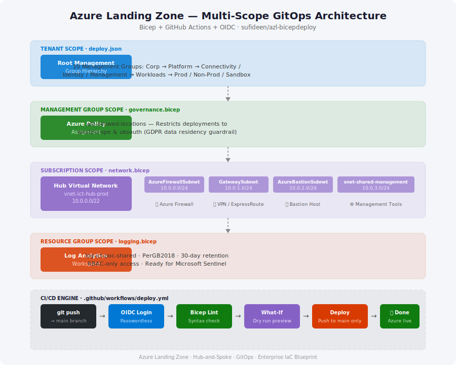
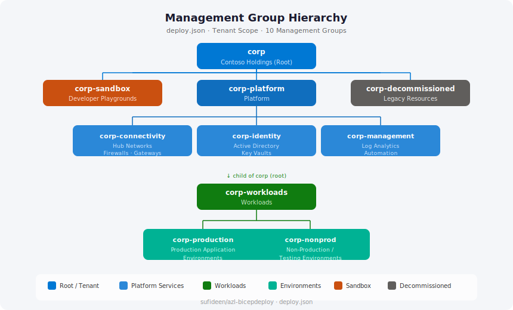
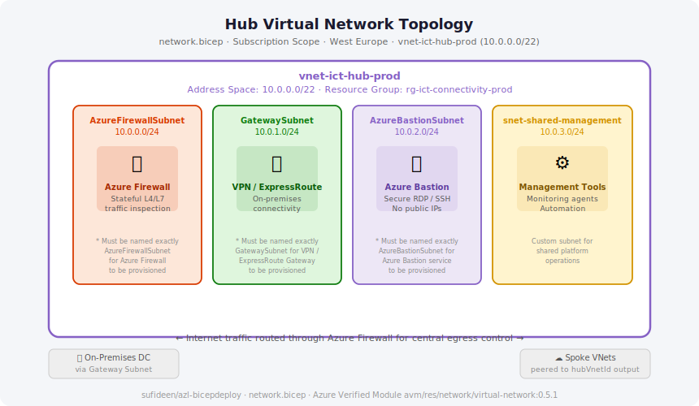
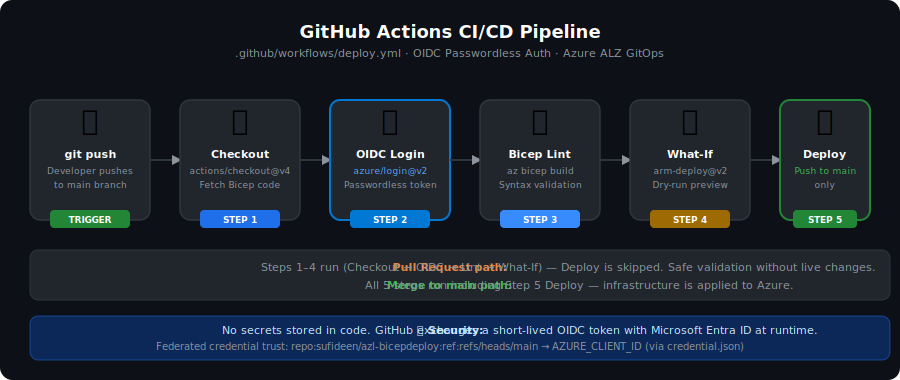
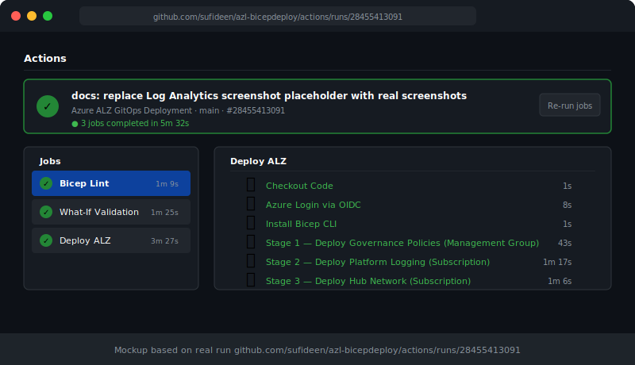
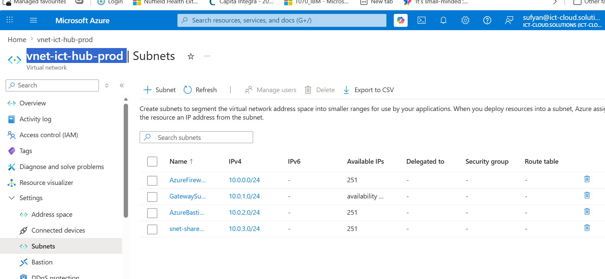
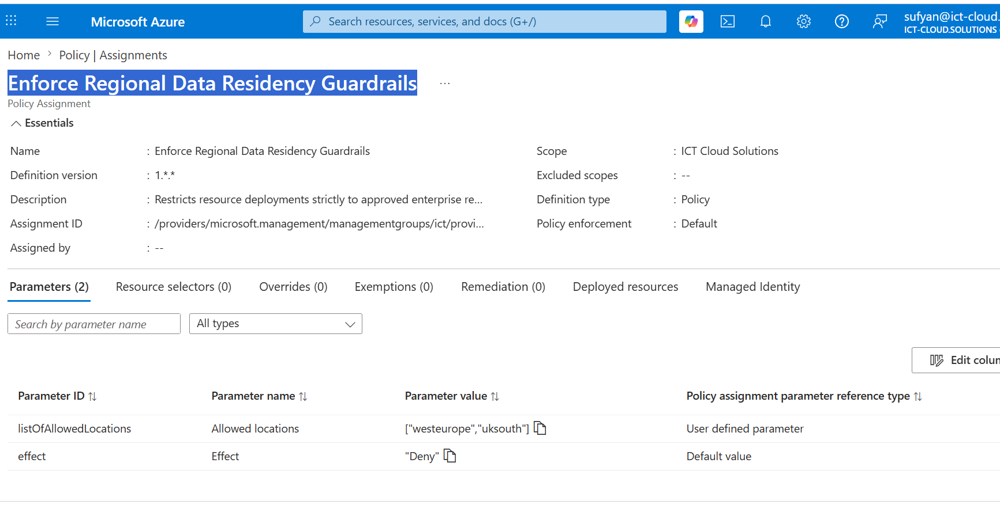
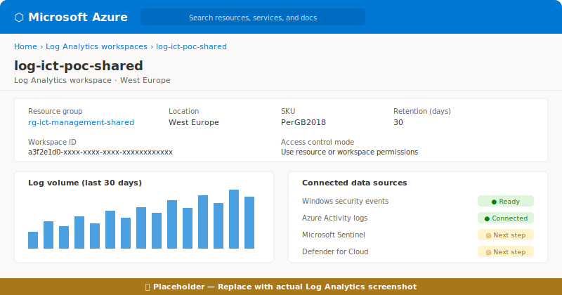

# Azure Landing Zone — Multi-Scope GitOps Engine

[](https://github.com/sufideen/azl-bicepdeploy/actions/workflows/deploy.yml)
[](LICENSE)
[](https://learn.microsoft.com/en-us/azure/azure-resource-manager/bicep/overview)
[](https://learn.microsoft.com/en-us/azure/active-directory/workload-identities/workload-identity-federation)

A fully automated, **production-aligned Azure Landing Zone (ALZ)** infrastructure-as-code blueprint. Deployed via **Bicep** and **GitHub Actions** using passwordless OpenID Connect (OIDC) — zero stored secrets.

---

## Architecture Overview

> Full diagram and screenshot gallery: **[docs/ARCHITECTURE.md](docs/ARCHITECTURE.md)**



This blueprint spans **four distinct Azure deployment scopes**, enforcing governance, platform operations, and enterprise networking from a single GitOps pipeline:

| Layer | Scope | File | Primary Resources |
|:---|:---|:---|:---|
| **Tenant / Root** | `tenant` | `deploy.json` | Management Group hierarchy (10 nodes) |
| **Governance** | `managementGroup` | `governance.bicep` | Policy Definitions & Assignments |
| **Shared Platform** | `resourceGroup` | `logging.bicep` | Log Analytics Workspace, Microsoft Sentinel-ready |
| **Network Edge** | `subscription` | `network.bicep` | Hub VNet & system subnets (Firewall, Gateway, Bastion) |

---

## What Was Built

This repository demonstrates enterprise-grade Azure cloud engineering across the full ALZ control plane. Each component is intentionally scoped to the correct Azure hierarchy level — a pattern that distinguishes professional platform engineering from ad-hoc resource deployments.

### Management Group Hierarchy (`deploy.json`)



A **10-node management group tree** establishes the organisational scaffold for the entire tenant. The hierarchy follows the Microsoft ALZ reference architecture:

- **`corp`** — root node representing the organisation (Contoso Holdings)
- **Platform tier** — `corp-connectivity`, `corp-identity`, `corp-management` — dedicated subscriptions for shared infrastructure services
- **Workloads tier** — `corp-production`, `corp-nonprod` — isolated environments for application teams
- **Lifecycle nodes** — `corp-sandbox` (permissive dev playground), `corp-decommissioned` (legacy archival)

This structure enables **inherited Azure Policy, RBAC, and cost management** to cascade automatically as workload subscriptions are added — no manual per-subscription configuration required.

### Data Residency Policy (`governance.bicep`)

Deployed at Management Group scope, the `alz-allowed-locations` assignment uses the Azure built-in **"Allowed Locations"** policy (`e56962a6-4747-49cd-b67b-bf8b01975c4c`) to **deny** any resource deployment outside `westeurope` or `uksouth`. This is a hard `Deny` effect — not audit-only — providing a technical enforcement layer for GDPR and UK data protection obligations.

### Centralised Logging (`logging.bicep`)

A **Log Analytics Workspace** (`log-ict-poc-shared`) provides the single observability plane for the platform. Key design decisions:

- **PerGB2018 SKU** — pay-as-you-go billing, no capacity reservation commitment required at this stage
- **30-day retention** — cost-optimised for the platform phase; parameterised up to 120 days for regulated workloads
- **`enableLogAccessUsingOnlyResourcePermissions: true`** — disables legacy shared workspace keys, enforcing RBAC-only access control
- **Outputs `workspaceId` and `workspaceCustomerId`** — ready for downstream resources (Firewall, VMs, Defender for Cloud) to connect diagnostic settings without circular references

### Hub Virtual Network (`network.bicep`)



The hub VNet (`vnet-ict-hub-prod`, `10.0.0.0/22`) is the **central routing and security control point** for a hub-and-spoke network topology. Deployed at subscription scope using the **Azure Verified Module** (`avm/res/network/virtual-network:0.5.1`) — a Microsoft-curated, production-validated module registry.

Four subnets are provisioned with their mandatory naming conventions respected:

| Subnet | CIDR | Reserved Service |
|:---|:---|:---|
| `AzureFirewallSubnet` | `10.0.0.0/24` | Azure Firewall (stateful L4/L7 inspection) |
| `GatewaySubnet` | `10.0.1.0/24` | VPN / ExpressRoute Gateway |
| `AzureBastionSubnet` | `10.0.2.0/24` | Azure Bastion (secure RDP/SSH without public IPs) |
| `snet-shared-management` | `10.0.3.0/24` | Monitoring agents, automation runbooks |

The VNet outputs `hubVnetId` — consumed by spoke VNet peering modules in downstream workload deployments.

### CI/CD Pipeline (`deploy.yml`)



Two GitHub Actions workflows handle the full ALZ deployment lifecycle:

**`deploy.yml`** — runs on every push and PR (day-to-day operations):

| Job | Trigger | What runs |
|:---|:---|:---|
| **Lint** | Every push & PR | `az bicep build` on all 5 Bicep files — no Azure credentials needed |
| **Validate** | Every push & PR (needs Lint) | `what-if` across Management Group + both Subscription deployments |
| **Deploy** | Push to `main` only (needs Validate) | Live: Governance Policy → Logging → Hub Network |

**`deploy-tenant.yml`** — tenant-scope Management Group hierarchy (infrequent, elevated permissions):

| Job | Trigger | What runs |
|:---|:---|:---|
| **Lint** | On `deploy.bicep` change or manual | `az bicep build` on `deploy.bicep` |
| **Validate** | Same (needs Lint) | `az deployment tenant what-if` |
| **Deploy** | Manual with `dry_run=false` or push to `deploy.bicep` | `az deployment tenant create` — Management Groups |

> **Why two pipelines?** Tenant-scope deployments require `Owner` at `/` (tenant root) — a Global Administrator grant separate from the root Management Group. Separating it avoids `AuthorizationFailed` errors on routine PR validation while keeping the tenant foundation deployable when needed.

---

## Security Posture

| Control | Implementation |
|:---|:---|
| **Passwordless auth** | GitHub Actions exchanges an OIDC token with Entra ID at runtime — no client secrets stored anywhere |
| **Branch-scoped trust** | OIDC federation is bound to `refs/heads/main` only — feature branches cannot authenticate |
| **Data residency** | Azure Policy hard-denies deployments outside `westeurope` / `uksouth` |
| **RBAC-only logging** | `enableLogAccessUsingOnlyResourcePermissions: true` on Log Analytics — no legacy shared keys |
| **Verified modules** | Hub VNet uses Microsoft's AVM registry — audited and maintained source |
| **No secrets in code** | `.gitignore` excludes `.env`, `*.psat`, `.azure/`, `*.secret.bicepdefaults` |

See [SECURITY.md](SECURITY.md) for the full security policy and vulnerability reporting process.

---

## Screenshots

> **Note:** The remaining placeholders below will be replaced with real screenshots as the platform is deployed further.

### GitHub Actions — Successful Pipeline Run



### Azure Portal — Hub Virtual Network



### Azure Portal — Policy Assignment



### Azure Portal — Log Analytics Workspace



---

## Next Steps

This repository establishes the **platform foundation layer** of the ALZ. The following capabilities extend it toward a fully operational, enterprise-ready cloud platform:

### Security & Compliance
- [ ] **Microsoft Sentinel** — enable on the Log Analytics workspace (`Microsoft.SecurityInsights/onboardingStates`) for SIEM/SOAR capability
- [ ] **Defender for Cloud** — enable the Microsoft Cloud Security Benchmark (MCSB) at Management Group scope via Bicep policy assignment
- [ ] **Policy-as-Code compliance pipeline** — add a pipeline stage to query `az policy state list` and fail the build on non-compliant resources
- [ ] **Azure Monitor Baseline Alerts (AMBA)** — deploy the community AMBA initiative for platform-level alerting on resource health and performance

### Networking
- [ ] **Azure Firewall** — deploy `Microsoft.Network/azureFirewalls` into `AzureFirewallSubnet` with UDRs forcing workload egress through central inspection
- [ ] **Spoke VNet peering module** — parameterised Bicep module consuming `hubVnetId` output to peer workload VNets to the hub
- [ ] **Private DNS Zones** — deploy `privatelink.*` zones for PaaS services (Key Vault, Storage, ACR, SQL) to enable private endpoint resolution
- [ ] **DDoS Protection Standard** — associate Azure DDoS Protection Plan with the hub VNet

### Platform Operations
- [ ] **Multi-environment promotion** — add `dev` and `staging` environments to the pipeline with GitHub environment protection rules and manual approval gates
- [ ] **Bicep module registry** — publish shared modules to an Azure Container Registry for reuse and versioning across teams
- [ ] **Cost governance** — deploy Azure Budget alerts at subscription scope via Bicep (`Microsoft.Consumption/budgets`)
- [ ] **Automation Account** — provision under `corp-management` for scheduled runbooks, Update Management, and DSC configuration

---

## Prerequisites

- An active **Azure subscription** with rights to assign roles at the root management group scope
- **Azure CLI** (`az`) authenticated to your tenant (`az login`)
- **Bicep CLI** (bundled with recent Azure CLI versions)
- A **GitHub repository** with Actions enabled

---

## Implementation Guide

Follow these phases sequentially to build, secure, and automate the infrastructure framework.

### Phase A — Local Workspace Initialization

```bash
git init
git branch -M main
git config --global user.name "your-github-username"
git config --global user.email "your-professional-email@domain.com"
```

### Phase B — Identity & Root Permissions

Register a dedicated platform application in Microsoft Entra ID:

```bash
# Create the Entra ID Application Registration
az ad app create --display-name "github-actions-alz-deploy"
# Copy the 'appId' from the output — this is your Client ID

# Create a Service Principal for the new Application ID
az ad sp create --id "YOUR_AZURE_CLIENT_ID"

# Grant Owner at the root Management Group scope (for governance, logging, and network deployments)
az role assignment create \
  --assignee "YOUR_AZURE_CLIENT_ID" \
  --role "Owner" \
  --scope "/providers/Microsoft.Management/managementGroups/YOUR_ROOT_MANAGEMENT_GROUP_ID"

# Grant Owner at the tenant root scope (required ONLY for deploy-tenant.yml — Management Group creation)
# This must be run by a Global Administrator
az role assignment create \
  --assignee "YOUR_AZURE_CLIENT_ID" \
  --role "Owner" \
  --scope "/"
```

> **Note on the two-scope grants:** Day-to-day deployments (governance policy, logging, networking) only require the Management Group Owner grant. The tenant root `/` grant is needed solely for `deploy-tenant.yml` which provisions the Management Group hierarchy — a one-time setup operation.

### Phase C — OIDC Trust Relationship

Create `credential.json` (template provided in this repo) and apply the federation link:

```bash
az ad app federated-credential create \
  --id "YOUR_AZURE_CLIENT_ID" \
  --parameters ./credential.json
```

This binds your repository's `main` branch to your Azure identity using short-lived tokens — no stored secrets required.

### Phase D — GitHub Repository Secrets

Navigate to **Settings → Secrets and variables → Actions** and add:

| Secret Name | Value |
|:---|:---|
| `AZURE_CLIENT_ID` | App Registration Client ID from Phase B |
| `AZURE_TENANT_ID` | Microsoft Entra Tenant ID |
| `AZURE_SUBSCRIPTION_ID` | Target Azure Subscription ID |
| `AZURE_MANAGEMENT_GROUP_ID` | Target Management Group ID for governance policies (e.g. `corp-workloads`) |

### Phase E — Deploy the Tenant Foundation

```bash
# Deploy the Management Group hierarchy first (tenant scope)
az deployment tenant create \
  --location westeurope \
  --template-file deploy.json \
  --parameters orgPrefix=corp orgDisplayName="Contoso Holdings"
```

### Phase F — Sync and Launch the GitOps Pipeline

```bash
git remote add origin https://github.com/YOUR_GITHUB_USERNAME/YOUR_REPO_NAME.git
git config pull.rebase false
git pull origin main --allow-unrelated-histories
git add .
git commit -m "feat: secure multi-scope baseline with OIDC automation engine"
git push -u origin main
```

---

## Verifying the Deployment

1. Open the **Actions** tab in your GitHub repository
2. Select the latest workflow run for your commit
3. Expand the `validate_and_deploy` job steps

A green checkmark confirms that your Bicep files compiled, passed lint, completed a successful What-If dry-run, and (on push to main) applied the Hub VNet infrastructure to Azure.

---

## Tearing Down

The deployed resources are low-cost (an empty VNet, an unused Log Analytics workspace, and a free policy assignment — no Firewall, Bastion, or Gateway is deployed), but `scripts/teardown.sh` gives a fast way to remove them between demos:

```bash
# Preview what would be deleted (no changes made)
./scripts/teardown.sh

# Actually delete the Resource Group-scoped resources (Hub VNet, Log Analytics) and the policy assignment
./scripts/teardown.sh --yes

# Also remove the 10-node Management Group hierarchy (deploy-tenant.yml output)
./scripts/teardown.sh --yes --include-mgmt-groups
```

Resource group deletions run with `--no-wait` (asynchronous) — check progress with `az group list` or in the Azure Portal. Requires the same `az login` / OIDC permissions used by the deploy pipelines.

---

## Repository Structure

```
azl-bicepdeploy/
├── .github/
│   └── workflows/
│       └── deploy.yml                     # 3-job pipeline: Lint → Validate → Deploy
├── docs/
│   ├── architecture-overview.svg          # Full ALZ scope diagram
│   ├── management-group-hierarchy.svg     # MG tree diagram
│   ├── hub-network-topology.svg           # Hub VNet subnet diagram
│   ├── cicd-pipeline.svg                  # Pipeline flow diagram
│   └── screenshots/
│       ├── github-actions-run.svg         # Screenshot placeholder
│       ├── azure-portal-vnet.png          # Hub VNet screenshot
│       ├── azure-portal-policy.png        # Policy assignment screenshot
│       └── azure-portal-log-analytics.svg # Screenshot placeholder
├── modules/
│   └── log-workspace.bicep                # Reusable Log Analytics module (resourceGroup scope)
├── parameters/
│   ├── deploy.bicepparam                  # Params for deploy.bicep
│   ├── governance.bicepparam              # Params for governance.bicep
│   ├── logging.bicepparam                 # Params for logging.bicep
│   └── network.bicepparam                 # Params for network.bicep
├── scripts/
│   └── teardown.sh             # Removes deployed billable resources (dry-run by default)
├── bicepconfig.json            # Bicep linting rules & AVM module alias
├── deploy.bicep                # Tenant scope: Management Group hierarchy (10 nodes)
├── deploy.json                 # Legacy ARM template (superseded by deploy.bicep)
├── governance.bicep            # Management Group scope: Policy assignment
├── logging.bicep               # Subscription scope: RG + Log Analytics Workspace
├── network.bicep               # Subscription scope: RG + Hub VNet & subnets
├── credential.json             # OIDC federated credential template
├── .env.example                # Environment variable reference (4 secrets)
├── SECURITY.md                 # Security policy & vulnerability reporting
└── LICENSE                     # GNU General Public License v3
```

---

*Azure Landing Zone · Hub-and-Spoke · GitOps · Enterprise IaC Blueprint*
