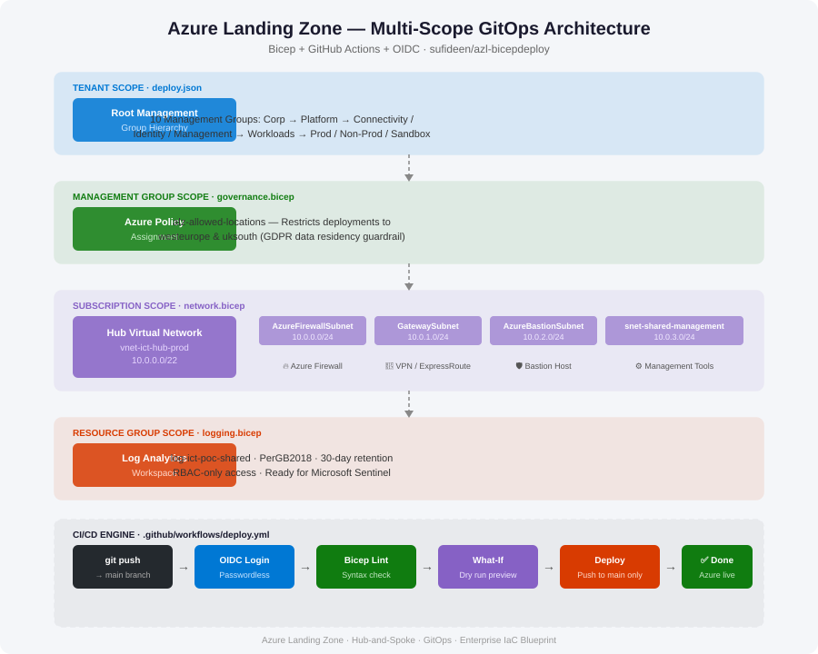
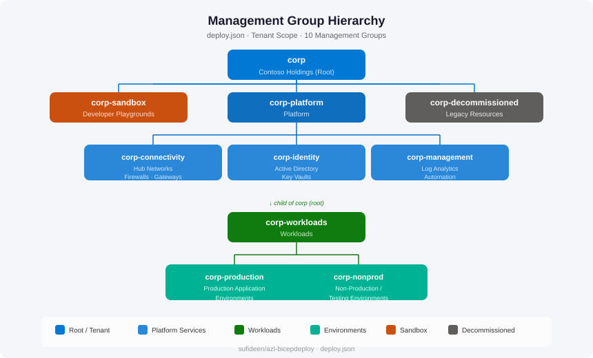
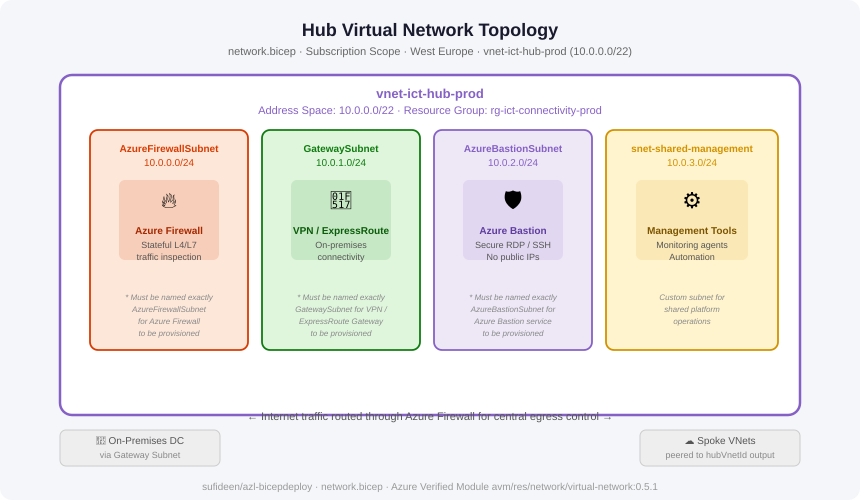
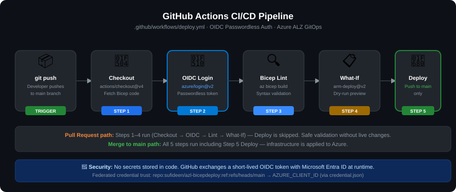
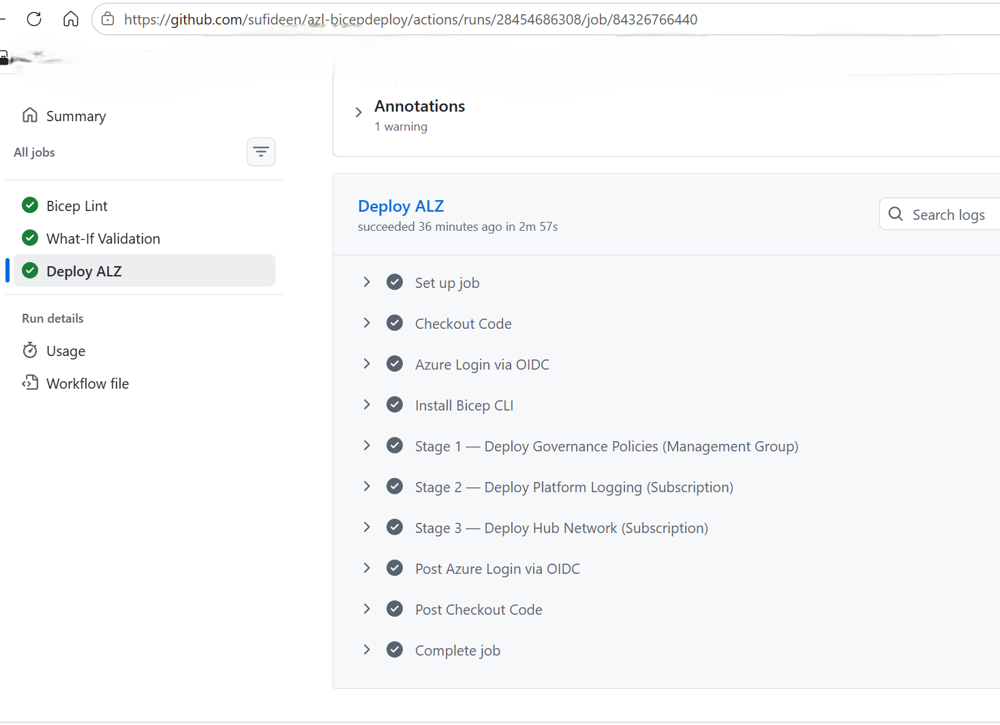
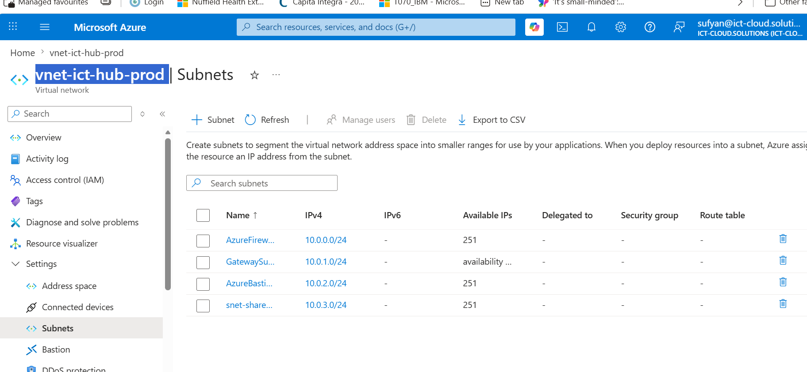
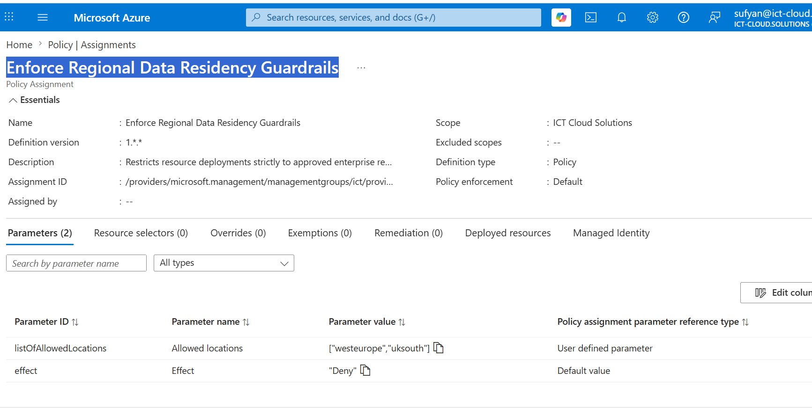
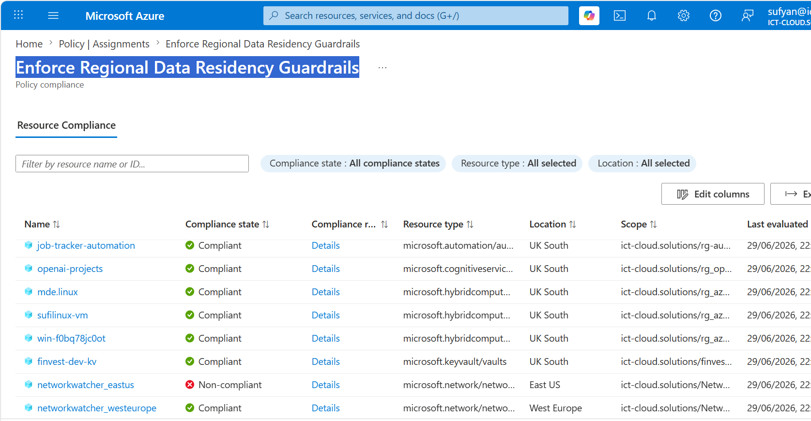
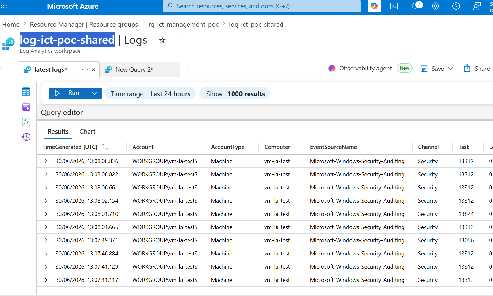
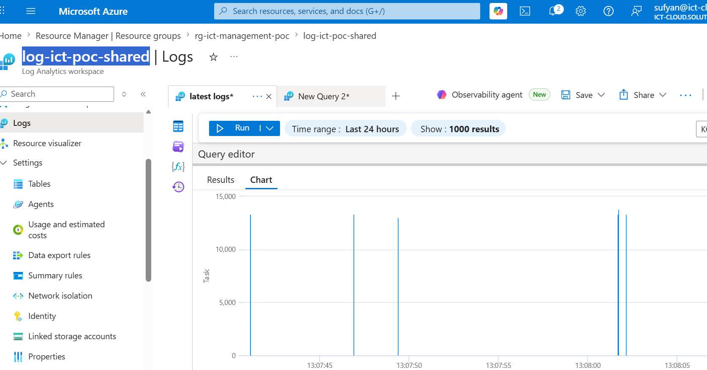

# Architecture Reference

This document is the single-page technical reference for the **Azure Landing Zone (ALZ) Multi-Scope GitOps Engine** — a production-aligned infrastructure-as-code blueprint spanning four Azure deployment scopes (tenant, management group, subscription, resource group), deployed via Bicep and GitHub Actions using passwordless OIDC authentication.

---

## Diagrams

### 1. Overall Architecture — All Four Scopes

Shows the complete ALZ stack: Management Group hierarchy at tenant scope, data-residency policy at management group scope, Hub VNet at subscription scope, and Log Analytics at resource group scope — all driven by a single GitHub Actions pipeline.

| Layer | Scope | Bicep File |
|:---|:---|:---|
| Tenant / Root | `tenant` | `deploy.bicep` |
| Governance | `managementGroup` | `governance.bicep` |
| Shared Platform | `resourceGroup` (via subscription module) | `logging.bicep` → `modules/log-workspace.bicep` |
| Network Edge | `subscription` | `network.bicep` |
| Observability & Alerting | `resourceGroup` (via subscription module) | `monitoring.bicep` → `modules/{action-group,service-health-alert,budget-alert,metric-alert,monitoring-workbook}.bicep` |

---

### 2. Management Group Hierarchy

Ten management groups structured in three tiers: root → platform services → workload environments. All child subscriptions inherit Azure Policy and RBAC assignments from their parent nodes automatically.

| Management Group | Parent | Purpose |
|:---|:---|:---|
| `corp` | Tenant root | Organisation root node |
| `corp-platform` | corp | Shared infrastructure services |
| `corp-connectivity` | corp-platform | Hub networks, Firewalls, Gateways |
| `corp-identity` | corp-platform | Active Directory, Key Vaults |
| `corp-management` | corp-platform | Log Analytics, Automation |
| `corp-workloads` | corp | Application workload subscriptions |
| `corp-production` | corp-workloads | Production environments |
| `corp-nonprod` | corp-workloads | Non-production / testing |
| `corp-sandbox` | corp | Developer playgrounds |
| `corp-decommissioned` | corp | Legacy / retired resources |

---

### 3. Hub Virtual Network Topology

Central hub VNet (`10.0.0.0/22`) with four reserved subnets. Subnet names are mandatory — Azure services (Firewall, Gateway, Bastion) require exact naming to provision correctly. The hub VNet outputs `hubVnetId` for spoke VNet peering modules.

| Subnet | CIDR | Hosted Service | Naming Constraint |
|:---|:---|:---|:---|
| `AzureFirewallSubnet` | `10.0.0.0/24` | Azure Firewall | Mandatory exact name |
| `GatewaySubnet` | `10.0.1.0/24` | VPN / ExpressRoute Gateway | Mandatory exact name |
| `AzureBastionSubnet` | `10.0.2.0/24` | Azure Bastion | Mandatory exact name |
| `snet-shared-management` | `10.0.3.0/24` | Management agents, Automation | Custom |

---

### 4. CI/CD Pipeline Flow

Three-job GitHub Actions pipeline (`deploy.yml`). Lint runs without Azure credentials. Validate runs a What-If dry-run across the Management Group and Subscription-scope stages on every push and PR (Tenant scope is handled separately by `deploy-tenant.yml`, since it needs Owner at `/`). Deploy executes the live four-stage deployment only on merge to `main`.

| Job | Trigger | Steps |
|:---|:---|:---|
| **Lint** | Every push & PR | `bicep build` on every `.bicep` file in the repo |
| **Validate** | Every push & PR (needs Lint) | `what-if` across MG (Governance) → Sub (Logging) → Sub (Network) → Sub (Monitoring) |
| **Deploy** | Push to `main` only (needs Validate) | Live deploy of all four Subscription/MG stages in sequence |

---

### 5. Monitoring & Alerting

`monitoring.bicep` (subscription scope, Stage 4) deploys into its own `rg-ict-monitoring-poc` resource group, separate from the Log Analytics Workspace's resource group — this keeps the raw telemetry store's change cadence decoupled from alerting/dashboard changes. It looks up the shared workspace deployed by `logging.bicep` via an `existing` reference (the same "reference by well-known name" pattern `vm-onboarding.bicep` uses for its target VM resource group, since this repo does not chain outputs across separate `az deployment` invocations).

| Component | Bicep Module | Resource Type |
|:---|:---|:---|
| Action Group | `modules/action-group.bicep` | `Microsoft.Insights/actionGroups` |
| Service Health Alert | `modules/service-health-alert.bicep` | `Microsoft.Insights/activityLogAlerts` |
| Cost Budget | `modules/budget-alert.bicep` | `Microsoft.Consumption/budgets` |
| Resource Utilization Alerts | `modules/metric-alert.bicep` | `Microsoft.Insights/metricAlerts` |
| Platform Monitoring Workbook | `modules/monitoring-workbook.bicep` | `Microsoft.Insights/workbooks` |

The Action Group is the single notification target for all three alert types. The Service Health alert fires on any `ServiceHealth` Activity Log event for the subscription. The budget notifies at 80% actual spend and 100% forecasted spend. Resource-utilization alerts are array-driven via the `resourceUtilizationAlerts` parameter — it defaults to an empty array so the pipeline stays green until real target resource IDs are populated, the same gating idiom `logging.bicep` uses for `deploySecurityEventsDcr`. The workbook renders three tabs (Performance, Availability, Cost) with live KQL against the shared workspace.

Application Insights is treated as a per-workload concern rather than a shared platform resource — `app-insights-onboarding.bicep` (repo root) references an existing workload resource group and deploys `modules/app-insights.bicep` (workspace-based, linked to the shared Log Analytics workspace) into it. Like `vm-onboarding.bicep`, it targets infrastructure that doesn't exist reproducibly in this platform-only repo, so it is lint-only in CI rather than part of the What-If/Deploy stages.

---

## Screenshots

> All screenshots below are from the live deployed platform.

### GitHub Actions — Successful Pipeline Run

Shows the three-job pipeline (Bicep Lint, What-If Validation, Deploy ALZ) passing with green checkmarks, each staged across Management Group, Subscription, and Hub Network scopes.

See the real run: [Azure ALZ GitOps Deployment #28455413091](https://github.com/sufideen/azl-bicepdeploy/actions/runs/28455413091)

---

### Azure Portal — Hub Virtual Network

Shows `vnet-ict-hub-prod` in the Azure Portal with address space `10.0.0.0/22` and all four subnets listed.

---

### Azure Portal — Policy Assignment

Shows the `alz-allowed-locations` policy assignment at management group scope with compliance state and the two permitted regions.

---

### Azure Portal — Log Analytics Workspace

Shows `log-ict-poc-shared` in the Azure Portal with SKU, retention period, and connected data sources.

---

## File Reference Map

| Diagram / Screenshot | Documents | Source File |
|:---|:---|:---|
| `architecture-overview.svg` | Full ALZ deployment topology | All four Bicep files |
| `management-group-hierarchy.svg` | Org governance structure | `deploy.bicep` |
| `hub-network-topology.svg` | Hub VNet subnets and services | `network.bicep` |
| `cicd-pipeline.svg` | GitHub Actions workflow | `.github/workflows/deploy.yml` |
| `screenshots/github-actions-run.png` | Live pipeline execution (run #28455413091) | `.github/workflows/deploy.yml` |
| `screenshots/azure-portal-vnet.png` | Deployed hub VNet | `network.bicep` |
| `screenshots/azure-portal-policy.png` | Active policy assignment | `governance.bicep` |
| `screenshots/log-ict-poc-shared.png` | Deployed workspace + live SecurityEvent query results | `logging.bicep` + `modules/log-workspace.bicep` |
| `screenshots/log-ict-poc-shared02.png` | Deployed workspace + live SecurityEvent query results | `logging.bicep` + `modules/log-workspace.bicep` |
